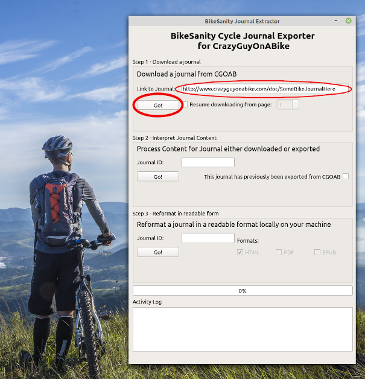
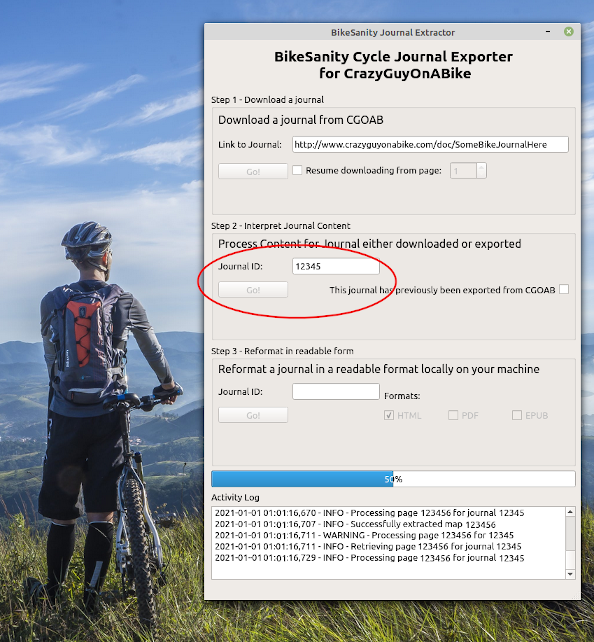
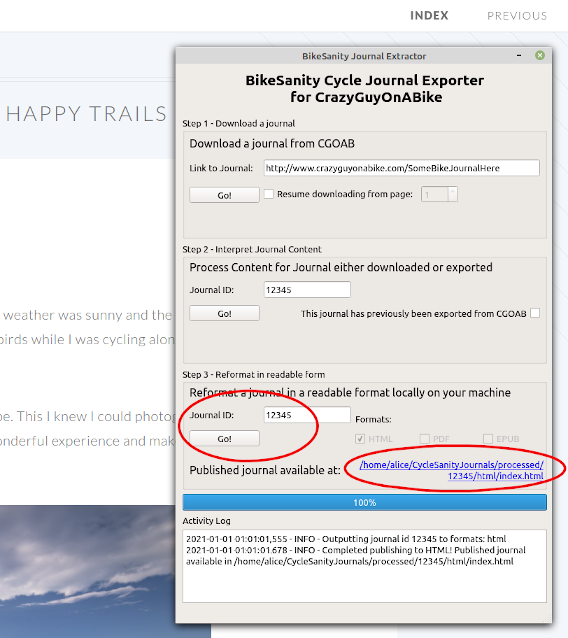

# BikeSanity Desktop - Cycle Journal Exporter for CrazyGuyOnABike

### What is this?

This is a user friendly version of the _bikesanity_ library that provides a desktop application with a simple, point and click user interface. You can use it download and create backups of your CGOAB journals, to interpret them into a form where the content is easier to extract, and to re-format them in various formats readable offline.

Unlike [**the library**](https://github.com/JohnHenrySplitMyHeart/bikesanity/), no programming or scripting experience is neccessary - you can retrieve and convert your journals with just three clicks of the mouse!

[**Here's a sample**](https://www.bikejournalbackup.com/journals/sample/index.html) of what a converted journal will look like.

### Quick start

Once you've installed the tool, exporting journals is as easy as 1-2-3

1. Download your journal from CGOAB. To do this, you'll need a link to the front page of the journal. This can either be the URL or the "permalink" - either is fine. Paste it in the box and click "Go!".

You might need to wait a few minutes or more for large journals - don't worry, the tool will keep you updated on its progress. If a download fails in the middle for some reason, you can pick it back up from a given page.

2. Let the tool interpret the journal and extract its contents. All you need here is the journal ID - e.g. `12345` - which will be given to you when the download finishes. This is very fast!

The output of this stage is a technical thing called a "pickle" that contains all the information in the journal in a way that's easy to work with. If you'd like, by sending me this (see below) I can host your newly converted journal on [**bikejournalbackup.com**](https://www.bikejournalbackup.com).

3. Turn the journal into shiny new HTML. Again, with the journal ID in the box, just one click will convert it and publish to your local machine. Coming soon: PDF and EPUB (for ebooks) output!

Click on the link to view the HTML.

### How do I get it?

Complete installers are available for:

- Windows 7/10 as an `.exe` package
- Linux (Ubuntu variants) as a `.deb` package
- A Mac version will be coming soon!

You can download the latest packages using the links above (or in the _Releases_ section). You can also download installers from [**bikejournalbackup.com**](https://www.bikejournalbackup.com/download).

Once you've run the installer, the application **BikeSanity** will be available in your start menu. You can update and uninstall it using the tools in your control panel (or by running the installer again).

### What can it do?

All the authored content in journals can be recovered, including all pages, text, extra parts, images and maps ("social" content such as guestbooks will not be retrieved). The content can then be re-formatted into a new, clean design - including conversion of maps to a standard format browsable locally.

The retrieved files will be stored on your machine in the `CycleSanityJournals` folder in your user area, where they can be viewed locally. This will typically be:

- `C:\Users\<usr\CycleSanityJournals` on Windows
- `/home/<usr>/CycleSanityJournals`on Mac and Linux

Have a journal that's previously been exported from CGOAB? That's no problem - you'll just need to copy it to a new folder called `exported` inside the `CycleSanityJournals` directory. Then enter its ID (the number it was exported as, e.g. 12345) in the process box, click the checkbox, and you can load that too.

### Can I republish a journal where other people can read it?

Sure! I'll be happy to host converted journals on [**bikejournalbackup.com**](https://www.bikejournalbackup.com). 

There are two ways you can do this:

1. Perform the conversion yourself, and then send me the `journal.pickle` file generated by the interpreter (you'll find this inside `processed`). I can do the rest.
2. If you're having any trouble generating this, let me know the title/id of your journal and I can perform the conversion for you.

Naturally, you'll retain full rights to your journal content, and it can be added/removed from bikejournalbackup.com whenever you wish. bikejournalbackup.com will never charge for access, procure donations, show adverts, resell your data, or track or monetize its users in any way.

### Who can use it?

Absolutely anyone. This tool is free and open source, and is provided as a service to the cycle touring community. 

The user interface program and installer is licensed under the open-source GPL v3. 

### Why is this necessary

A discussion of the reasons a tool like this is necessary is available [**in the README**](https://github.com/JohnHenrySplitMyHeart/bikesanity#why-is-this-necessary) for the bikesanity library.

### Troubleshooting

##### It's taking a very long time to download my journal

CGOAB imposes rate limiting meaning only 3 or 4 pages can be downloaded a minute. This affects people just browsing the website too! But it means that very large journals might take a little while to download. The progress bar and log will continue to be updated - make yourself a cup of coffee, come back in 15 minutes and it'll likely be done.

##### My download failed in the middle

No worries! You can try it again, picking up from where it left off. In the log, it will indicate what page number it got to - simply check `Resume downloading from page` and plug that number into the box, and click Go! again.

##### My virus scanner/Windows Defender flags this

The application contains a whole mini-runtime of the Python programming language - and it's not uncommon for virus scanners to trip up over this. It always pays to be cautious here, but rest assurred that this is a false positive and their is nothing dangerous in these packages :-) The complete code is open for inspection!

##### Help, it still won't install or run!

Please do let me know the problem by raising an issue here or contacting me using the details on [**bikejournalbackup.com**](https://www.bikejournalbackup.com). 

If you are having trouble running locally, I will generally be very happy to run an extraction for you and send you the results. Get into contact and let me know the details.

### Technical users

#### Can I run the GUI without installation?

You can! The GUI is a pure Python program based on PyQT5 built using the excellent [FBS](https://build-system.fman.io/) platform. It will run under any environment which supports Python and Qt. You will need Python 3.6 (later version may also work). Download or clone this repository to get started, and then create a virtual environment in the repo directory:

    python -m venv venv
    source venv/bin/activate (mac/linux)
    call venv\scripts\activate.bat (windows)

All extraction is performed under the hood using the `bikesanity` (Python module)[https://pypi.org/project/bikesanity/]. This, and all dependencies including Qt and FBS, can be installed using `pip` as normal:

    pip install -r requirements.txt

Then to run the GUI, it's as simple as executing

    fbs run

#### I'd like to modify the HTML templates or stylesheets used for output

Sure - all HTML templates and stylesheets reside in `src/main/resources/base/bikesanity/resources`. These can be modified in the installed application, or before rebuilding as above. NB removing elements or changing `
` identifiers may lead to unexpected behavior.

